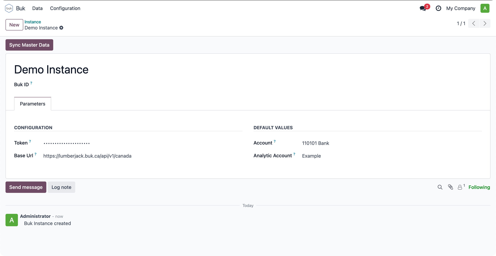
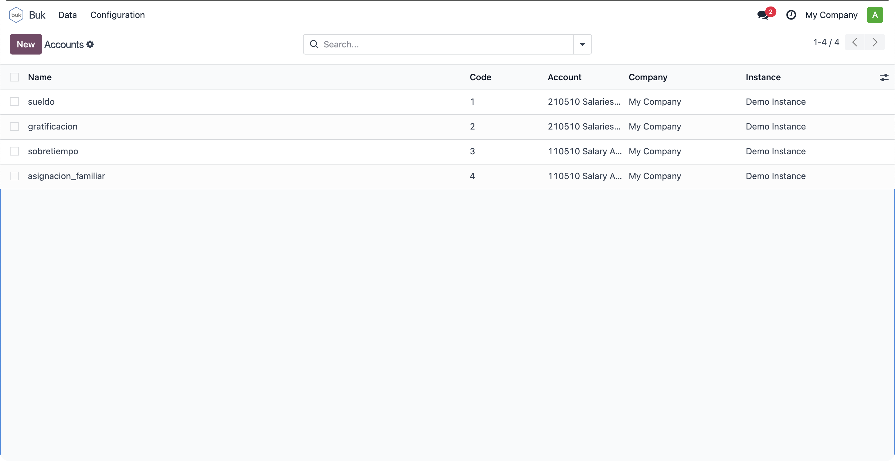
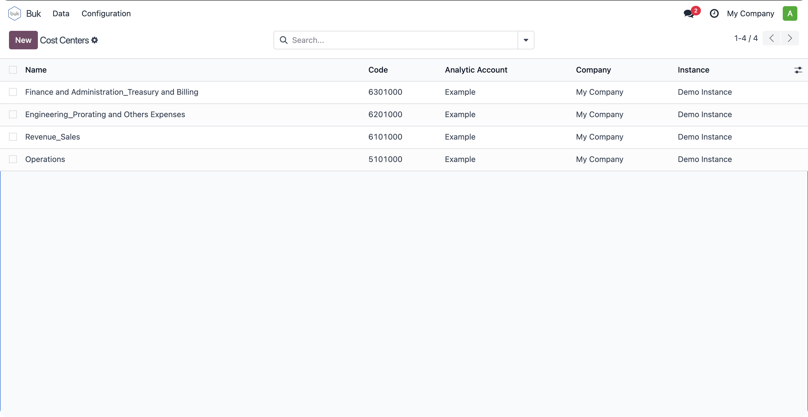
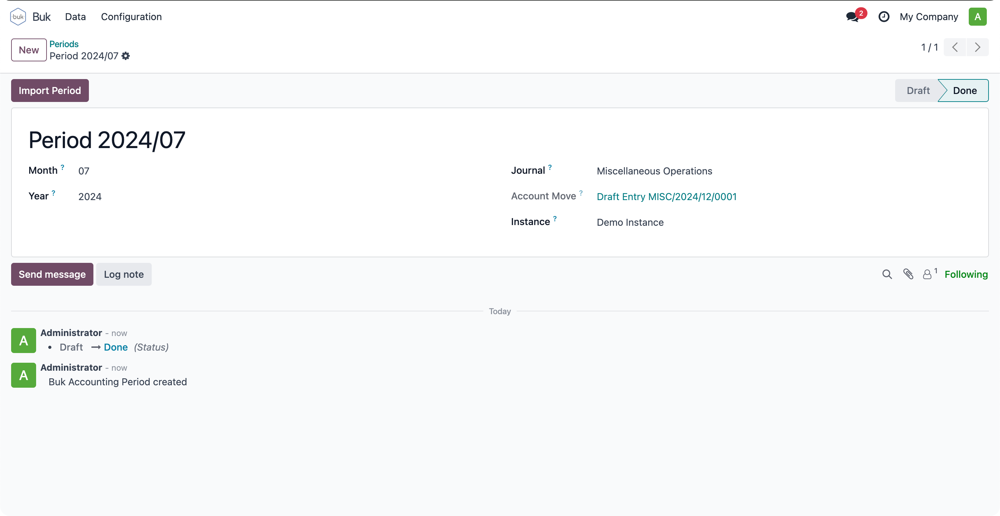
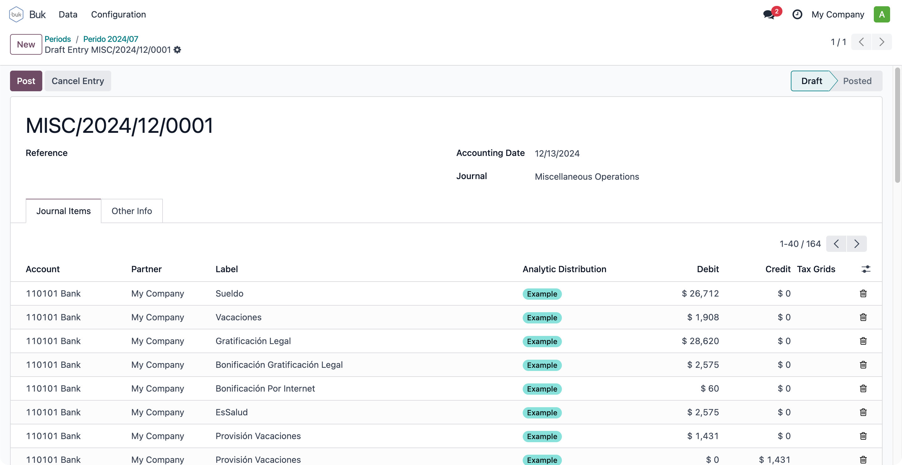

# Buk Connector

Streamlined connector for data synchronization with Odoo.

## Configuration

1. Set your instance

- Go to _Buk > Configuration > Instances_.
- Create a new instance by providing the required parameters.

2. Sync Master Data

- Once the instance is configured, click the **Sync Master Data** button to import Buk account and cost center information.

> [!IMPORTANT]
> Don't forget to associate the respective Odoo's account and analytic account to each imported record.

## How it Works

- Go to _Buk > Data > Periods_.
- Create the period you want to import, then click the **Import period** button.

- This will generate a journal entry that corresponds to the account centralization for the selected period.

> [!WARNING]
> Periods can only be imported once. Be cautious when confirming this action

## Credits

### Authors

- Konos Soluciones & Servicios

### Contributors

- Alexander Olivares <<aolivares@konos.cl>>

### Licence

This module is licensed under [GNU General Public License v3.0](LICENSE).
