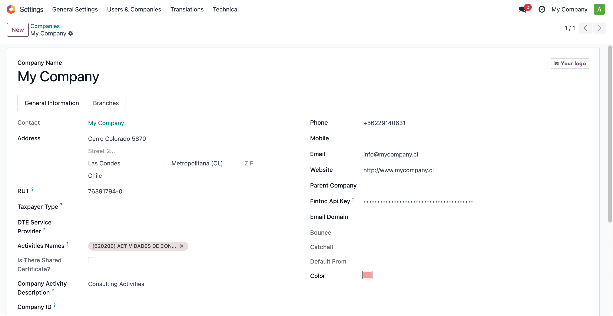
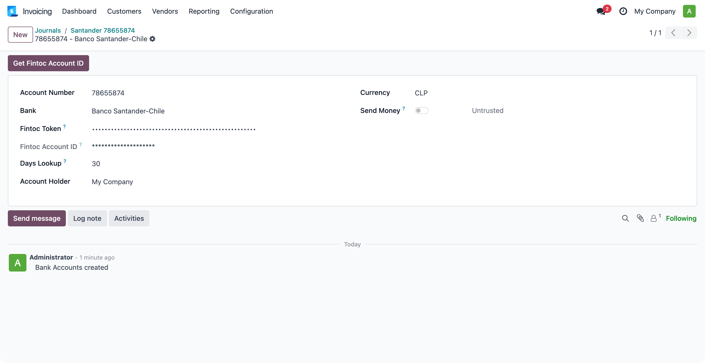
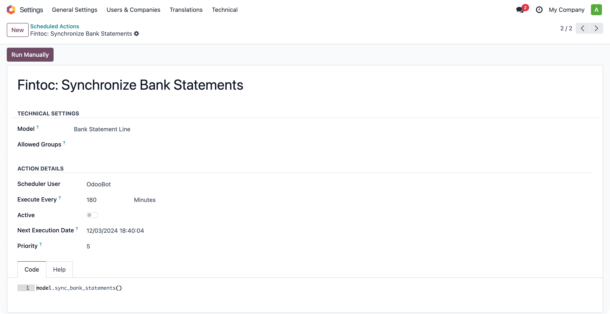

# Fintoc Connector

Retrieve bank statements directly from Fintoc into Odoo.

## Configuration

1. Set Up the Fintoc API Key

- Go to _Settings > User & Companies > Companies_.
- In the corresponding field, enter your **Fintoc API Key**.

> [!TIP]
> To obtain your secret key and public key from Fintoc, refer to the
> [Fintoc Documentation](https://docs.fintoc.com/docs/guides-api-keys).

2. Obtain the Fintoc Account Identifier

- Go to _Invoicing > Configuration > Journals_.
- Select a journal and click the internal link to the bank account.
- In the resulting window, enter the **Fintoc Token** and click the **Get Fintoc Account ID** button
  to retrieve the account identifier.

> [!TIP]
> For instructions on how to create a banking link and obtain a link token, refer to the
> [Fintoc Documentation](https://docs.fintoc.com/docs/guides-banking-link-from-dashboard).

## How it Works

This module uses a scheduled action to automatically synchronize bank statements from Fintoc to
Odoo at defined intervals.

> [!IMPORTANT]
> You can configure the execution frequency of the scheduled action, as well as the number of
> days to look back when fetching bank statements.

## Credits

### Authors

- Konos Soluciones & Servicios

### Contributors

- Alexander Olivares <<aolivares@konos.cl>>
- Nelson Ramirez <<nramirez@konos.cl>>

### Licence

This module is licensed under [GNU General Public License v3.0](LICENSE).
